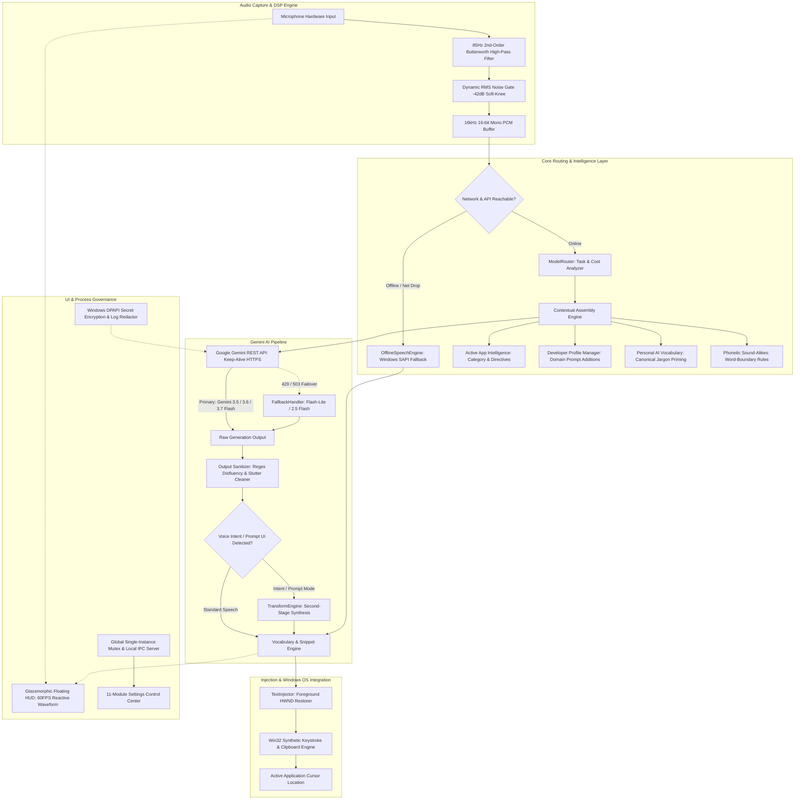
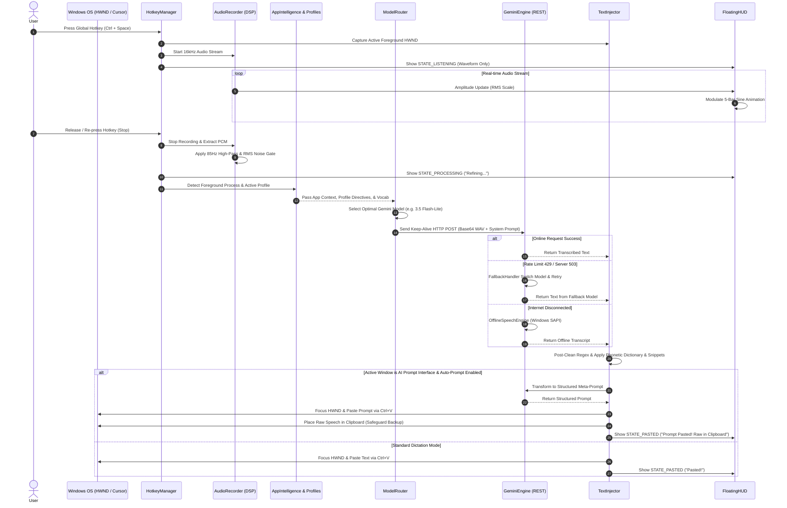

# GEMINI FLOW: COMPLETE SYSTEM ARCHITECTURE & MIGRATION SPECIFICATION

---

## TABLE OF CONTENTS
1. [System Overview & Architecture](#1-system-overview--architecture)
2. [User Interface (UI) Component Inventory](#2-user-interface-ui-component-inventory)
3. [Gemini Flow & Data Pipeline Specification](#3-gemini-flow--data-pipeline-specification)
4. [Functional Capabilities & Behavioral Logic](#4-functional-capabilities--behavioral-logic)
5. [State Management & API Integration Matrix](#5-state-management--api-integration-matrix)
6. [Functional Parity & Cross-Platform Migration Blueprint](#6-functional-parity--cross-platform-migration-blueprint)

---

# 1. SYSTEM OVERVIEW & ARCHITECTURE

## 1.1 High-Level System Definition
**Gemini Flow** is an open-source, high-performance, context-aware AI desktop voice dictation and prompt engineering assistant for Windows (10/11 64-bit). Designed as a production-grade, privacy-first alternative to Wispr Flow, it interfaces directly with **Google Gemini 3.5, 3.6, and 3.7 Flash** models via Google AI Studio API endpoints to perform real-time speech-to-text transcription, verbal disfluency elimination, grammatical elevation, Indian English/Hinglish idiom normalization, code formatting, in-place text transformations, and structured meta-prompt generation.

## 1.2 System Architecture Diagram


## 1.3 Core Runtime Topology & Process Architecture
1. **Single-Instance Mutex & Local Named Pipe IPC**:
   - Enforces single-instance execution via Win32 Named Mutex `Global\GeminiFlow_SingleInstance_Mutex`.
   - Secondary process launches forward commands (`SHOW`, `RESTART`) over local pipe `GeminiFlow_SingleInstance_IPC` before gracefully exiting.
   - PID tracking file stored at `%APPDATA%\GeminiFlow\gemini_flow.pid` facilitates automatic cleanup of unresponsive background zombie processes.
2. **Audio Streaming & DSP Engine**:
   - Captures continuous 16kHz 16-bit mono audio chunks through `sounddevice` / `PyAudio`.
   - Applies an in-line **85 Hz 2nd-order Butterworth High-Pass filter** via `scipy.signal.sosfilt` to cut ceiling fan, AC motor rumble, and 50/60 Hz electrical hum.
   - Executes a **Dynamic RMS Noise Gate** across 20ms sliding frames with a -42 dB threshold and 6 dB soft-knee transition curve to suppress background room noise and breathing pauses.
3. **Global Input Hook & Watchdog Subsystem**:
   - Listens to global hardware keyboard and mouse triggers via `pynput.keyboard.Listener` backed by direct `ctypes.windll.user32.GetAsyncKeyState` state verification.
   - Supports dual trigger modes: **Hands-Free Toggle** (press to start, press to stop) and **Push-to-Talk** (hold while speaking, release to type).
   - Inactivity and OS sleep/wake watchdog checks system time intervals every 5 seconds, auto-recovering lost key hooks upon laptop resume from standby and terminating recordings that exceed the 5-minute safety threshold.
4. **Context & App Intelligence Engine**:
   - Queries the active foreground window handle (`HWND`), resolves its executable name, process ID, and sanitized title.
   - Matches the active workspace against an internal registry of application categories (`dev`, `ai_chat`, `communication`, `email`, `writing`, `browser`, `general`) to adjust system prompt directives, temperature, and vocabulary priorities.
5. **Dynamic Model Router & Economizer**:
   - Dynamically evaluates task complexity, audio duration, active application, and user profile to route requests across `gemini-3.5-flash-lite`, `gemini-3.5-flash`, `gemini-3.6-flash`, `gemini-3.7-flash`, `gemini-2.5-flash`, and `gemini-2.5-pro`.
   - Optional **Auto Cost Mode** enforces ultra-low latency (<1.2s) and minimum token expenditure for short dictations using `gemini-3.5-flash-lite`, reserving heavy reasoning models strictly for long-form synthesis.
6. **Resilient Failover & Offline Recovery**:
   - Wraps API execution in an exponential backoff retry loop (0.4s $\times 2^n$) for transient errors (`500`, `503`, `TIMEOUT`).
   - Executes instant failover down a prioritized model hierarchy upon encountering HTTP `429 Rate Limit` / `RESOURCE_EXHAUSTED`.
   - Triggers an embedded **Offline Speech Recognition Engine** (Windows SAPI `SpInprocRecognizer` / `speech_recognition`) whenever the network drops or the cloud API is unreachable.
7. **Keystroke & Clipboard Text Injector**:
   - Preserves foreground target `HWND` upon speech initiation.
   - Safely updates the Windows clipboard with exponential retry for lock contention, simulates Win32 `Ctrl + V` via `keybd_event`, and optionally replaces clipboard contents with raw spoken backup text to prevent data loss.

---

# 2. USER INTERFACE (UI) COMPONENT INVENTORY

```text
+---------------------------------------------------------------------------------------------+
|                                    GEMINI FLOW UI SYSTEM                                    |
+---------------------------------------------------------------------------------------------+
|  [1. Floating HUD]         Frameless Glassmorphic Pill | 5-Bar Reactive Waveform | Zero-Text|
|  [2. System Tray]          Dynamic Vector Mic Icon (Indigo/Red/Purple) | Context Control Menu|
|  [3. Settings Dialog]      11-Tab Dark Themed Master Control Center (#0F172A / #1E293B)     |
|   |-- Tab 1: API & General         (API Keys, Connectivity Test, Model Selection, Startup)  |
|   |-- Tab 2: Hotkeys & Mode        (Interactive Key Capture, Toggle vs Push-to-Talk)        |
|   |-- Tab 3: Cost & Productivity   (Token Counters, Quota Meter, Milestones, ROI Savings)  |
|   |-- Tab 4: Vocabulary Engine     (Canonical Terms, Aliases, Jargon Priming, Categories)   |
|   |-- Tab 5: Custom Dictionary     (Phonetic Word-Boundary Sound-Alike Replacement Pairs)   |
|   |-- Tab 6: Quick Text            (Spoken Trigger Macros, Multi-Line Template Expansion)   |
|   |-- Tab 7: Dictation History     (5000 Records, Multi-Filter Tree, Pinned Guard, Export)  |
|   |-- Tab 8: Profiles              (Domain Personas: Engineering, Coding, Academic, etc.)   |
|   |-- Tab 9: AI Dictation Modes    (3 Core Presets, Prompt Customizer, Live Sync)           |
|   |-- Tab 10: AI Model Router      (Model Health Metrics, Dynamic Load Balancer)            |
|   |-- Tab 11: Audio Device & DSP   (Microphone Selector, 85Hz High-Pass & Noise Gate Sliders)|
+---------------------------------------------------------------------------------------------+
```

## 2.1 Floating Glassmorphic HUD Pill (`FloatingHUD`)
- **Widget Hierarchy**: `QWidget` $\rightarrow$ `QHBoxLayout` $\rightarrow$ [`AudioWaveWidget`, `QLabel(status_icon)`, `QLabel(status_label)`].
- **Window Flags**: `FramelessWindowHint`, `WindowStaysOnTopHint`, `Tool` (omits taskbar entry), `WindowDoesNotAcceptFocus` (prevents stealing cursor focus from target editor).
- **Visual Styling**: 80% translucent glassmorphism (`rgba(15, 23, 42, 0.82)`), 3D embossed border (`rgba(129, 140, 248, 0.65)`), rounded pill geometry (border radius: 20px).
- **Core Internal Components**:
  - `AudioWaveWidget`: Custom painting widget displaying 5 animated vertical rounded bars (width 3.6px, spacing 5.2px). Driven by a 60 FPS `QTimer` (16ms) running a sine-wave phase modulation algorithm scaled by real-time RMS microphone amplitude with a smooth 0.93 decay multiplier. Painted with a vertical linear gradient from Electric Indigo (`#6366F1`) to Luminous Cyan (`#06B6D4`).
  - `status_icon`: Fixed 15px icon label displaying state glyphs (`⚡`, `✨`, `✅`, `📋`, `⚠️`, `🚫`, `🎙️`).
  - `status_label`: Demi-bold Segoe UI 9pt label displaying brief confirmation messages.
- **Dynamic State Matrix & Geometry Anchor**:
  - `STATE_LISTENING`: Width 115px, Height 40px. Displays **only** centered reactive audio wave bars. Text labels are strictly hidden to ensure zero visual distraction.
  - `STATE_PROCESSING`: Width 155px, Height 40px. Waveform hidden; displays `⚡` icon and `"Refining with Gemini..."`.
  - `STATE_PROMPT`: Width 165px, Height 40px. Displays `✨` icon and `"Prompt Ready"`.
  - `STATE_PASTED`: Width 140px, Height 40px. Displays `✅` icon and `"Pasted!"` (Auto-hides after 1.4s).
  - `STATE_COPIED`: Width 150px, Height 40px. Displays `📋` icon and `"Copied to Clipboard!"` (Auto-hides after 1.8s).
  - `STATE_ERROR`: Width 165px, Height 40px. Displays `⚠️` icon and sanitized error message (Auto-hides after 2.8s).
  - `STATE_CANCELLED`: Width 165px, Height 40px. Displays `🚫` icon and `"Speech Cancelled"` (Auto-hides after 1.0s).
  - `STATE_OFFLINE`: Width 185px, Height 40px. Displays `🎙️` icon and `"Offline Dictation Pasted!"`.
- **Screen Geometry & Drag Persistence**:
  - Defaults to horizontal bottom-center of the primary monitor (55px above taskbar).
  - Supports unrestricted left-click or right-click dragging across multi-monitor setups; clamping algorithms ensure coordinates remain within visible desktop boundaries and persist to `%APPDATA%\GeminiFlow\config.json`.

## 2.2 System Tray Module (`SystemTrayManager`)
- **Widget Type**: `QSystemTrayIcon`.
- **Dynamic Icon Rendering**: `create_mic_pixmap` draws a 64x64 RGBA vector microphone directly onto a `QPixmap` (dark capsule, cradle arc, stem, base) colored according to real-time engine state:
  - *Indigo (`#6366F1`)*: Ready / Standby.
  - *Red (`#EF4444`)*: Audio Recording Active.
  - *Purple (`#A855F7`)*: Gemini AI Cloud Processing.
- **Context Menu Actions**:
  - `● Gemini Flow: Ready` (Header status display).
  - `⚙️ Settings & Configuration` $\rightarrow$ Opens main Settings dialog.
  - `📜 Transcription History` $\rightarrow$ Opens Settings switched directly to History tab.
  - `💰 Cost & Productivity` $\rightarrow$ Opens Settings switched to Cost Dashboard.
  - `Switch to Push-to-Talk / Toggle Mode` $\rightarrow$ Immediate mode toggle.
  - `✨ AI Prompt Mode / 🗣️ Pure Speech Mode` $\rightarrow$ Switches IDE auto-prompt conversion state.
  - `🔄 Restart Gemini Flow` $\rightarrow$ Clean process reload.
  - `❌ Exit Gemini Flow` $\rightarrow$ Releases mutex, terminates hooks, and cleanly quits application.

## 2.3 Settings Control Center (`SettingsDialog`)
Comprehensive 11-tab dark-themed control center (`#0F172A` background, `#1E293B` panel cards, `#38BDF8` accent highlights, custom high-DPI radio and checkbox vector indicators):
- **Tab 1: 🔑 API_General**:
  - Masked API key input field with `👁️ Show/Hide` toggle and Windows DPAPI encrypted storage.
  - `Test API` button: Dispatches a 5-second asynchronous validation ping across fallback models (`gemini-3.5-flash-lite`, `gemini-3.5-flash`, `gemini-2.5-flash`).
  - Model selection combo box (`auto` router or explicit model lock).
  - Checkboxes for `Start with Windows (Registry + Shell:Startup)`, `Audio Feedback Cues (Winsound Beeps)`, `Auto-Paste text into active window`, and HUD opacity slider (0.10 to 1.00).
- **Tab 2: ⌨️ Hotkeys_Mode**:
  - Interactive `HotkeyCaptureButton` for Main Voice Hotkey (default `Ctrl + Space`), AI Prompt Hotkey (default `Ctrl + Shift + P`), and Universal Text Transform Hotkey (default `Ctrl + Shift + T`).
  - Real-time key listener capturing physical modifiers (`Ctrl`, `Shift`, `Alt`, `Win`) and keys (`Space`, `F1-F12`, alphanumerics).
  - Radio button group for `Hands-Free Toggle Mode` vs `Push-to-Talk Mode`.
  - Clickable shortcut history chips for instant switching.
- **Tab 3: 💰 Cost_Productivity**:
  - Temporal consumption analytics aggregated across `Today`, `This Week`, and `All-Time`.
  - Progress bar tracking daily token usage against the Google AI Studio 1,000,000 free tokens/day quota.
  - Gamified Voice Milestone Progress Meter: 9-tier rank calculation (from *Voice Novice (0 words)* up to *Grand Novelist (50,000 words)*).
  - Productivity metrics calculating net time saved assuming a 40 WPM baseline manual typing speed.
- **Tab 4: 📁 Vocabulary Engine**:
  - Table-based repository for technical terms, proper names, and domain jargon.
  - Fields: Canonical Term, Spoken Aliases (comma-separated), Category, Case-Sensitive flag, and Notes.
  - Search filter bar and category dropdown.
  - Automatically compiles entries into a prompt injection block for Gemini priming.
- **Tab 5: 📖 Custom Dictionary**:
  - Phonetic mapping table for phonetic sound-alikes (e.g., `"Srinivas Avasthi"` $\rightarrow$ `"Sri Srinivas Awasthi"`).
  - Modal editor (`DictEditDialog`) with word-boundary regex substitution enforcement.
- **Tab 6: ⚡ Quick Text**:
  - Voice-activated macro expansions and snippets table (e.g., `"my social links"` $\rightarrow$ multi-line URL block).
  - Modal editor (`SnippetEditDialog`) supporting multi-line templates and conversational prefix matching.
- **Tab 7: 📜 History**:
  - Searchable repository storing up to 5,000 dictation and transformation records.
  - Hierarchical `QTreeWidget` navigation categorized by Date, Model, Target Application, and Transformation Type.
  - Multi-line transcript delegate (`HistoryTranscriptDelegate`) with word-boundary ellipsis.
  - Split detail view: Raw Speech Transcript vs Transformed AI Prompt / Output.
  - One-click copy, toggle Favorite/Pin status, CSV/JSON export, and History Retention governance controls (purge unpinned records older than 7/14/30/90 days).
- **Tab 8: ⚡ Profiles**:
  - Developer productivity personas: `Engineering & Architecture`, `Coding & Development`, `Professional & Executive`, `Academic & Research`, and `Casual & Everyday Dictation`.
  - Configurable system prompt additions, preferred model routing, and vocabulary categories per profile.
- **Tab 9: 🧠 AI Dictation**:
  - Core dictation prompt presets: *Clean Speech & Grammar Enhancement*, *Smart Executive Polish*, *Developer Code & Technical Assistant*.
  - Live prompt editor, custom prompt storage, and active preset radio switcher.
- **Tab 10: 🎯 AI Model Router**:
  - Live registry display of all supported Gemini models, typical latencies, speed ratings (1-5), and reasoning capabilities.
  - Auto-Cost Mode toggle and model health status indicators.
- **Tab 11: 🎙️ Audio Device**:
  - Dynamic input audio device selector querying system microphones via `sounddevice.query_devices()`.
  - Live microphone test button and real-time audio level progress bar.
  - DSP Filter toggles: **85 Hz Butterworth High-Pass Filter** and **Dynamic RMS Noise Gate** with dB threshold slider (-60 dB to -20 dB).

---

# 3. GEMINI FLOW & DATA PIPELINE SPECIFICATION

## 3.1 End-to-End Execution Sequence Diagram


## 3.2 Audio Capture & DSP Preprocessing Pipeline
- **Sampling Parameters**: 16,000 Hz, 1 Channel (Mono), 32-bit Float normalized input (-1.0 to 1.0), converted to 16-bit Linear PCM WAV bytes upon finalization.
- **DSP Filter 1: 85 Hz 2nd-Order Butterworth High-Pass**:
  ```python
  from scipy import signal
  sos = signal.butter(N=2, Wn=85.0, btype='highpass', fs=16000, output='sos')
  filtered_audio = signal.sosfilt(sos, raw_audio, axis=0)
  ```
  *Operational Purpose*: Attenuates mechanical ceiling fan motor rumble (typically 20–75 Hz), AC air currents, and AC line hum (50/60 Hz) prior to model ingestion.
- **DSP Filter 2: Dynamic RMS Noise Gate**:
  ```python
  frame_len = int(16000 * 0.02) # 20ms frame = 320 samples
  # Computes RMS per frame: 20 * log10(RMS + 1e-9)
  # Applies soft-knee gain curve around threshold (default: -42.0 dB, knee width: 6.0 dB)
  # Gated frame gains attenuate baseline room hiss down to 5% (0.05 multiplier)
  ```

## 3.3 Contextual Prompt Assembly
The `ConfigManager.get_system_prompt` method constructs the complete system prompt dynamically through four layered directives:

```text
+---------------------------------------------------------------------------------------------+
|                               SYSTEM PROMPT ASSEMBLY STACK                                  |
+---------------------------------------------------------------------------------------------+
| 1. Base Core Prompt Directive:                                                              |
|    - Clean Speech / Smart Executive Polish / Developer Code / Prompt Enhancer               |
|    - Filler Elimination, Stutter Reduction, Hinglish/Indian English Grammar Rules           |
|    - Spoken Punctuation Formats ('bullet point' -> '• ', 'new line' -> '\n')                |
+---------------------------------------------------------------------------------------------+
| 2. Active Profile Directive (ProfileManager):                                               |
|    - [Profile Directive - Coding]: "Adopt Senior Staff Engineer style, format identifiers"  |
+---------------------------------------------------------------------------------------------+
| 3. Application Context Directive (AppIntelligenceManager):                                  |
|    - [App Context - VS Code (dev)]: "Tone: Technical, precise. Formatting: Clean syntax"    |
+---------------------------------------------------------------------------------------------+
| 4. Phonetic Dictionary & Vocabulary Priming:                                                |
|    - Phonetic Replacement Rules: 'Srinivas Avasthi' -> 'Sri Srinivas Awasthi'               |
|    - Canonical Jargon List: "TypeScript, PyTorch, LeetCode, Antigravity, GitHub"            |
+---------------------------------------------------------------------------------------------+
```

## 3.4 API Request Payload Structure
- **Target Endpoint**: `https://generativelanguage.googleapis.com/v1beta/models/{model}:generateContent?key={API_KEY}`
- **Protocol**: HTTPS 1.1 / Keep-Alive with persistent `requests.Session()`.
- **Payload Schema**:
  ```json
  {
    "contents": [
      {
        "parts": [
          {
            "text": "{SYSTEM_INSTRUCTION_AND_TASK_DIRECTIVE}"
          },
          {
            "inline_data": {
              "mime_type": "audio/wav",
              "data": "{BASE64_ENCODED_WAV_BYTES}"
            }
          }
        ]
      }
    ],
    "generationConfig": {
      "temperature": 0.0,
      "topP": 0.9,
      "maxOutputTokens": 2048
    }
  }
  ```

## 3.5 Post-Processing & Output Normalization
1. **Preamble & Code Fence Stripping**:
   - Strips leading/trailing markdown code fences (```` ``` ````) and accidental outer quotation marks (`"..."`).
2. **Deterministic Verbal Hesitation & Disfluency Scrubbing**:
   - Regex pass strips residual filler tokens:
     `\b(uh|um|ah|er|eh|uhm|ahm|umm|ahh|uhh)\b[,;:]*`
3. **Stutter & Repetition Collapse**:
   - Collapses identical repeating words, ordinals, numbers, or phrases up to 3 tokens long:
     `\b(\w+(?:\s+\w+){1,3})(?:[\s,;—\-]+)\1\b` $\rightarrow$ `\1`
     (e.g., `"12 12 12"` $\rightarrow$ `"12"`, `"12th 12th"` $\rightarrow$ `"12th"`, `"and and"` $\rightarrow$ `"and"`).
4. **Punctuation Normalization**:
   - Normalizes consecutive commas, removes leading punctuation slips, fixes spacing before punctuation marks, and ensures proper initial capitalization.
5. **Dictionary & Snippet Expansion**:
   - Replaces phonetic variants via boundary-checked regex patterns.
   - Evaluates conversational triggers to expand multi-line snippets.

---

# 4. FUNCTIONAL CAPABILITIES & BEHAVIORAL LOGIC

## 4.1 Universal Voice Dictation (Toggle & Push-to-Talk)
- **Definition**: System-wide voice-to-text typing into any focused Windows UI element.
- **Mechanics**: Pressing the assigned shortcut (`Ctrl + Space`) triggers foreground window handle caching, initiates audio streaming, and displays the glassmorphic HUD. Stopping the recording sends filtered audio to Gemini, sanitizes the response, restores window focus, copies text to the clipboard, and simulates Win32 `Ctrl + V`.
- **Behavior**: Transcribes speech with punctuation, capitalization, and zero filler words directly at the cursor location.

## 4.2 3-Style Core AI Dictation Engine
- **Clean Speech & Grammar Enhancement**:
  - *Definition*: Flawless transcription with grammatical elevation.
  - *Mechanics*: Strips all hesitations (`uh`, `um`, `basically`, `means`), fixes subject-verb agreement and Indian English colloquialisms (`"did you went"` $\rightarrow$ `"did you go"`, `"two datas"` $\rightarrow$ `"two datasets"`), and formats spoken punctuation commands (`"bullet point"`, `"new line"`, `"colon"`).
  - *Behavior*: Produces standard, articulate English prose.
- **Smart Executive Polish**:
  - *Definition*: High-impact business communications transform.
  - *Mechanics*: Restructures rambling thoughts into concise executive summaries, auto-formatting multi-point thoughts into bullet lists (`• `) and separating paragraphs.
  - *Behavior*: Outputs boardroom-ready memos, client replies, and meeting briefs.
- **Developer Code & Technical Assistant**:
  - *Definition*: Programming and technical documentation dictation.
  - *Mechanics*: Enforces casing conventions (`camelCase`, `snake_case`), correctly types library names, terminal flags (`--config`), and formats technical explanations.
  - *Behavior*: Inserts clean code comments, PR notes, and CLI commands.

## 4.3 Hinglish & Indian Idiom Normalization
- **Definition**: Cultural and linguistic bridge for Indian English and mixed Hindi speech.
- **Mechanics**: Detects colloquial phrases (`yaar`, `bhai`, `jugaad`, `ek bar check karo`, `ye code mein issue hai`, `prepone`) within the prompt instructions and translates conversational intent into professional English while preserving numerical units (`Lakhs`, `Crores`) and native proper nouns (`UPI`, `Aadhaar`).
- **Behavior**: Converts `"Arre bhai, please check karo why the payment API is failing"` $\rightarrow$ `"Could you please investigate why the payment API is failing?"`.

## 4.4 AI Prompt Engineering Mode (`Ctrl + Shift + P` & Auto-Conversion)
- **Definition**: Spoken thought conversion into structured LLM meta-prompts.
- **Mechanics**: Triggered via hotkey (`Ctrl + Shift + P`) on highlighted text/speech or automatically when dictating inside designated AI prompt environments (Antigravity, Cursor, Windsurf, ChatGPT, Claude). Dispatches a specialized prompt engineering prompt to Gemini.
- **Behavior**: Formats thoughts into structured prompts containing:
  - `# Role & Objective`
  - `# Context & Requirements`
  - `# Step-by-Step Instructions`
  - `# Expected Output Format`
  - *Clipboard Safeguard*: Types the structured prompt into the editor while simultaneously storing the user's raw spoken transcript in the Windows clipboard as a safety backup.

## 4.5 In-Place Text Transformer (`Ctrl + Shift + T`)
- **Definition**: Highlight-and-transform utility operating across any Windows software.
- **Mechanics**: Simulates Win32 `Ctrl + C` to capture highlighted text, identifies the target application, and applies one of 16 built-in transformation presets:
  1. `IMPROVE` (Enhance flow & cadence)
  2. `FIX_GRAMMAR` (Proofread punctuation & typos)
  3. `PROFESSIONAL` (Executive corporate tone)
  4. `CASUAL` (Relaxed chat tone)
  5. `CONCISE` (Remove fluff)
  6. `EXPAND` (Elaborate with depth)
  7. `SUMMARIZE` (Executive bullet points)
  8. `EXPLAIN` (Step-by-step breakdown)
  9. `TECHNICAL` (Software documentation standards)
  10. `CONVERT_PROMPT` (Structured AI prompt)
  11. `CONVERT_EMAIL` (Subject line + body + sign-off)
  12. `CONVERT_GITHUB_ISSUE` (Repro steps + environment)
  13. `CONVERT_GITHUB_PR` (Description + test plan + checklist)
  14. `CONVERT_DOCS` (Docstrings & API specs)
  15. `CONVERT_NOTES` (Action items with checkboxes)
  16. `CUSTOM` (User-defined instruction)
- **Behavior**: Replaces the highlighted selection in-place with the refined AI output.

## 4.6 Voice Intent Classification Engine
- **Definition**: Voice-triggered command routing (Utterance $\rightarrow$ Intent $\rightarrow$ Action).
- **Mechanics**: Analyzes the transcribed text against 18 intent regex patterns (e.g., `"summarize this: ..."`, `"make this professional: ..."`, `"translate to Spanish: ..."`). If a command is spoken without an explicit payload, it automatically adopts text from the system clipboard.
- **Behavior**: Automatically triggers the corresponding transformation without requiring manual hotkeys.

## 4.7 Intelligent AI Model Router & Economizer
- **Definition**: Latency-, capability-, and cost-optimized model routing engine.
- **Mechanics**: Evaluates task type, audio duration, application category, and active profile against the model registry:
  - `gemini-3.5-flash-lite`: Low latency (<0.8s) for real-time messaging, Antigravity cursor dictation, and Auto Cost Mode.
  - `gemini-3.5-flash`: Balanced latency (~1.3s) for daily emails, prompt engineering, and standard dictation.
  - `gemini-3.6-flash`: High reasoning (~1.5s) for executive polish, document expansion, and note synthesis.
  - `gemini-3.7-flash`: Technical reasoning (~2.1s) for developer code comments, PR descriptions, and VS Code.
  - `gemini-2.5-flash`: Formal textbook punctuation (~2.5s) for legal and academic writing.
  - `gemini-2.5-pro`: Deep thought (~5.0s) for long dictations (>60s) and multi-page documents.
- **Behavior**: Dispatches requests to the optimal model for the lowest latency and cost.

## 4.8 Offline Emergency Speech Recognition Fallback
- **Definition**: Local speech-to-text failover when offline or experiencing API downtime.
- **Mechanics**: Initializes `win32com.client.Dispatch('SAPI.SpInprocRecognizer')` with an in-memory WAV file stream and a single-shot dictation grammar.
- **Behavior**: Decodes spoken audio locally without internet connectivity, ensuring typing productivity continues uninterrupted.

## 4.9 Cost & Productivity Analytics Tracker
- **Definition**: Token, financial, and time-saving analytics system.
- **Mechanics**: Computes input/output token and audio duration costs using live Gemini model pricing tables. Evaluates total spoken word count against a 9-tier publication milestone scale and calculates net typing hours saved against a 40 WPM baseline.
- **Behavior**: Visualizes real-time metrics, quota progress, and milestone rankings in the UI dashboard.

## 4.10 Enterprise-Grade Security & Windows DPAPI Encryption
- **Definition**: Hardware-backed local credential protection and privacy controls.
- **Mechanics**: Encrypts API keys at rest using Windows `CryptProtectData` (DPAPI), persisting encrypted bytes to `%APPDATA%\GeminiFlow\.credentials.bin`. Attaches a regex `SensitiveDataFilter` to all logging streams to mask secrets (`AQ.Ab8...` $\rightarrow$ `[REDACTED_SECRET]`).
- **Behavior**: Zero third-party telemetry, 100% local configuration storage, and configurable history retention purging (7/14/30/90 days).

---

# 5. STATE MANAGEMENT & API INTEGRATION MATRIX

## 5.1 Application State & Storage Schema

### `config.json` Specification
```json
{
  "api_key": "",
  "model_name": "gemini-3.5-flash-lite",
  "model_mode": "auto",
  "active_profile": "coding",
  "hotkey": "<ctrl>+<space>",
  "hotkey_display": "Ctrl + Space",
  "hotkey_mode": "toggle",
  "prompt_hotkey": "<ctrl>+<shift>+p",
  "prompt_hotkey_display": "Ctrl + Shift + P",
  "transform_hotkey": "<ctrl>+<shift>+t",
  "transform_hotkey_display": "Ctrl + Shift + T",
  "mode_preset": "clean_dictation",
  "custom_prompt": "",
  "auto_cost_mode": true,
  "auto_prompt_conversion": false,
  "dsp_fan_filter_enabled": true,
  "dsp_noise_gate_enabled": true,
  "dsp_noise_gate_threshold_db": -42.0,
  "offline_fallback_enabled": true,
  "auto_paste": true,
  "play_sounds": true,
  "hud_position": "bottom_center",
  "hud_custom_x": null,
  "hud_custom_y": null,
  "hud_opacity": 0.20,
  "start_with_windows": true,
  "history_limit": 5000,
  "security": {
    "encrypt_keys": true,
    "history_retention_days": 30,
    "telemetry_enabled": true,
    "log_redaction": true
  }
}
```

### `history.json` Entry Schema
```json
{
  "id": "c7a84e29-96df-4a64-9a1b-3b6928e469b2",
  "timestamp": "2026-09-18T11:00:00.000000",
  "time_str": "2026-09-18 11:00:00 AM",
  "text": "Hey, could you please look into the issue in this code?",
  "raw_text": "arre bhai please check karo why this code is having issue",
  "prompt": "",
  "duration": 2.45,
  "mode": "clean_dictation",
  "model": "gemini-3.5-flash-lite",
  "app_name": "VS Code",
  "title": "Code Issue Review",
  "api_key_tag": "5QA",
  "is_pinned": false,
  "is_favorite": false
}
```

### `vocabulary.json` Entry Schema
```json
{
  "id": "e4b11f58-89c2-48df-a721-65f02bc4501a",
  "canonical_term": "TypeScript",
  "aliases": ["Typescript", "type script", "ts"],
  "category": "Programming",
  "enabled": true,
  "case_sensitive": true,
  "notes": "Frontend and full-stack codebase language"
}
```

## 5.2 API Integration & Error Handling Matrix

| HTTP Status / Condition | Root Cause Classification | FallbackHandler Policy & Recovery Behavior | User / HUD Notification |
|---|---|---|---|
| **200 OK** | Successful generation | Returns extracted text candidates; applies post-cleaning and normalization. | HUD transitions to `STATE_PASTED` (`"Pasted!"`). |
| **429 Rate Limit** / `RESOURCE_EXHAUSTED` | Per-minute quota or daily token limit hit | Bypasses retries; executes **instant failover** to next model in chain: `3.5 Flash` $\rightarrow$ `3.6 Flash` $\rightarrow$ `2.5 Flash` $\rightarrow$ `Flash-Lite`. | HUD shows brief processing warning, auto-recovering silently. |
| **503 Service Unavailable** / High Traffic | Temporary Google model server overload | Performs instant failover to alternate Flash tier model. | HUD displays `"Switching to next available model..."`. |
| **500 Internal Error** / Timeout | Transient gateway timeout or network hiccup | Executes exponential backoff retry ($0.4\text{s} \times 2^n$) up to 2 attempts per model before stepping down chain. | HUD displays `"Retrying with fallback model..."`. |
| **400 / 401 / 403** / `INVALID_KEY` | Malformed, expired, or unregistered Gemini API Key | Halts cloud execution immediately without retrying; prompts user with Google AI Studio key URL. | HUD displays `STATE_ERROR` (`"Invalid API Key"`). |
| **Network Disconnect** / Socket Error | Internet dropped or DNS failure | Triggers **OfflineSpeechEngine** (Windows SAPI local COM dictation). | HUD transitions to `STATE_OFFLINE` (`"Offline Dictation Pasted! 🎙️"`). |
| **Window Focus Loss** | Target window minimized during generation | Safely persists generated text to Windows Clipboard and alerts user. | HUD transitions to `STATE_COPIED` (`"Copied to Clipboard!"`). |

---

# 6. FUNCTIONAL PARITY & CROSS-PLATFORM MIGRATION BLUEPRINT

## 6.1 Cognitive Layer vs Host Execution Layer Portability

```text
+--------------------------------------------------------------------------------------------------+
|                                    GEMINI FLOW SYSTEM STACK                                      |
+--------------------------------------------------------------------------------------------------+
|  [COGNITIVE LAYER]  -> 100% Portable via Prompt & Context Injection                              |
|  - Verbal Filler Elimination (uh/um/means/matlab)   - Hinglish & Indian Idiom Translation        |
|  - Executive Polish & Bullet Formatting             - Structured Meta-Prompt Synthesis           |
|  - Technical Casing (camelCase / snake_case)        - Intent & Transformation Classification     |
+--------------------------------------------------------------------------------------------------+
|  [HOST RUNTIME LAYER] -> 0% Portable via Prompt Alone (Requires Native Desktop Host/Agent Tools) |
|  - 16kHz PyAudio Mic Stream & SciPy 85Hz DSP Filter - Dynamic RMS Noise Gate (-42dB Soft-Knee)    |
|  - Win32 Low-Level Hotkey Hooks (GetAsyncKeyState) - Win32 Keystroke & Clipboard Injection (Ctrl+V)|
|  - 60 FPS Frameless Glassmorphic Desktop HUD        - Windows SAPI Offline Speech Fallback (COM) |
|  - Windows DPAPI Hardware-Backed Secret Encryption  - Single-Instance Named Mutex & Named Pipe   |
+--------------------------------------------------------------------------------------------------+
```

## 6.2 Target Agent Migration Blueprint
For an external AI agent or workflow engine reconstructing this system natively within a Gemini-based flow, implement the following orchestration pipeline:

```text
[AUDIO INPUT STREAM]
       │
       ▼
[DSP PRE-FILTER]: 85Hz HighPass + NoiseGate(-42dB)
       │
       ▼
[CONTEXT EXTRACTOR]: Window HWND -> AppCategory (dev/chat/email/writing)
       │
       ▼
[MODEL ROUTER]:
  - If Duration < 25s & App == "dev"       -> gemini-3.5-flash-lite
  - If Task == "PROMPT" or "EXECUTIVE"     -> gemini-3.6-flash
  - If Task == "CODE" or "TECHNICAL"       -> gemini-3.7-flash
  - If Task == "LONG_DOC" (>60s)           -> gemini-2.5-pro
       │
       ▼
[PROMPT COMPILER]:
  Base Directive + Profile Injection + App Context + Phonetic Dictionary + Jargon Priming
       │
       ▼
[GEMINI MULTIMODAL INVOCATION]:
  models/{model}:generateContent (Audio Base64 + System Instruction, Temp=0.0)
       │
       ├───► [FAILOVER LOOP]: 429/503 -> Fallback Chain -> Offline SAPI
       ▼
[POST-PROCESSING SANITIZER]:
  Regex Filler Scrub -> Stutter Collapse -> Punctuation Repair -> Dictionary Replacement
       │
       ▼
[INTENT & INTERFACE BRANCH]:
  - If Target == AI Prompt Interface -> Gemini Transform(CONVERT_PROMPT) -> Paste Prompt + Speech to Clipboard
  - If Standard Text                 -> Inject Keystrokes (Ctrl+V)
       │
       ▼
[PERSISTENCE & TELEMETRY]:
  Append History (Raw + Transformed) -> Update Token Counter -> Evaluate Milestone Progress
```
