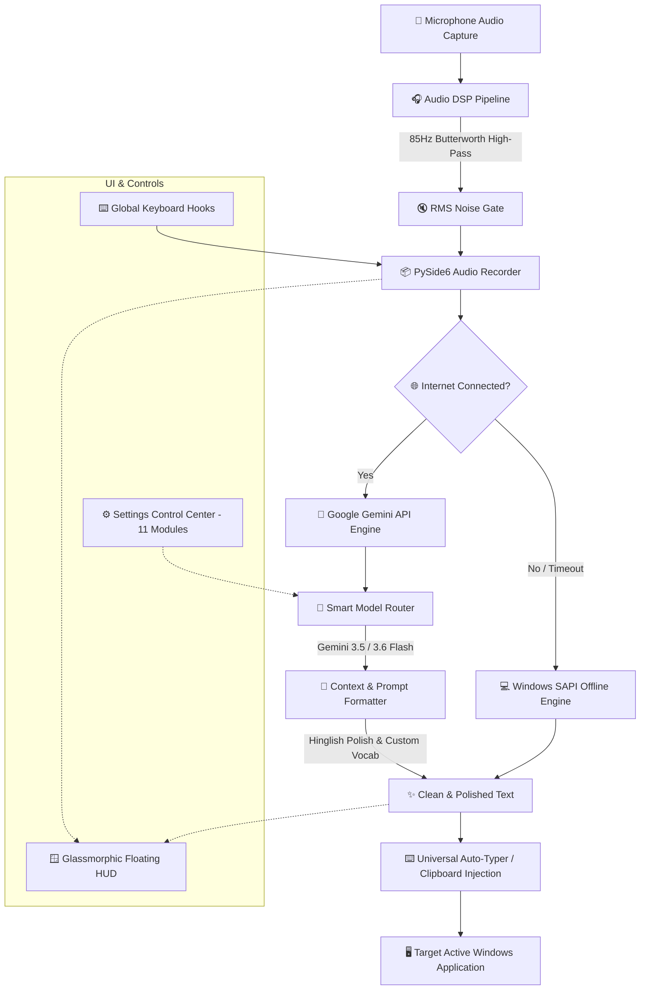

<div align="center">

# ⚡ Gemini Flow (Wispr Flow AI Alternative)

**Supercharge your typing with lightning-fast, context-aware AI voice dictation and prompt engineering powered by Google Gemini.**

[](https://python.org)
[](https://pypi.org/project/PyQt6/)
[](https://ai.google.dev/)
[](https://microsoft.com/windows)
[](LICENSE)

<br />

[Features](#-key-features) • [Application Showcase](#-application-showcase--ui-tour) • [Architecture](#-system-architecture) • [Setup Guide](#-step-by-step-implementation--setup-guide) • [How to Use](#-how-to-use) • [Shortcuts](#-keyboard-shortcuts-reference) • [License](#-license)

</div>

---

## 📖 Overview

**Gemini Flow** is an open-source, high-performance, and privacy-conscious AI voice dictation desktop assistant for Windows. Designed as a free, customizable alternative to *Wispr Flow*, Gemini Flow connects directly to **Google Gemini 3.5 & 3.6 Flash** models via your personal Google AI Studio API key.

Speak naturally in any Windows software—VS Code, Microsoft Word, Slack, WhatsApp, Telegram, or your favorite web browser—and Gemini Flow will filter background noise, remove verbal hesitation, polish Indian English/Hinglish idioms, format code syntax, and type the refined text directly at your cursor location.

---

## ✨ Key Features

- 🎙️ **Universal Auto-Typing**: Hold or toggle a global hotkey anywhere in Windows to speak; text types out smoothly into whatever field or editor has focus.
- ⚡ **Multi-Mode AI Engine**:
  - **Dictation Mode**: Flawless punctuation, clean paragraphs, removes filler words (`um`, `uh`, `matlab`, `yaani`), and formats bullet points.
  - **Prompt Mode**: Turns rambling verbal thoughts into structured, crystal-clear prompts ready for AI models and coding agents.
  - **Raw Mode**: Verbatim speech-to-text without AI reformatting.
- 🇮🇳 **Hinglish & Indian Idiom Polish**: Preserves everyday cultural expressions (`bhai`, `jugaad`, `lakhs/crores`, `prepone`) while eliminating broken grammar or translation glitches.
- 🎧 **DSP Audio Filter & Ceiling Fan Gate**:
  - Real-time 85 Hz Butterworth High-Pass Filter cuts motor drone and fan rumble.
  - Adaptive RMS Noise Gate suppresses ambient background noise when silent.
- 📶 **Offline Emergency Fallback**: Seamlessly switches to local Windows Speech Recognition (SAPI) whenever internet connection drops or API rate limits are reached.
- 🎨 **Sleek Glassmorphic Floating HUD**: Minimal, non-intrusive floating overlay with dynamic pulse audio waveforms, status badges, and subtle glow animations.
- 🎛️ **Intelligent Cost Economizer & Token Tracking**: Per-API key token tracker, daily 1,000,000 free token monitor, cost productivity calculator, and automatic cost-saving model selector.
- 📚 **Custom Vocabulary & Sound-Alikes**: Define technical terms, acronyms, and phonetic substitutions to ensure 100% transcription accuracy for custom terminology.

---

## 🖼️ Application Showcase & UI Tour

Explore the core modules and visual interface of Gemini Flow:

### 1. Minimalist Glassmorphic Floating HUD

> **Real-Time Dynamic Audio Waveform**: Displays pulsating sound wave bars in real-time as you speak and provides subtle visual status updates during AI processing.  
> **Non-Intrusive Floating Overlay**: Stays floating above your active workspace without stealing keyboard focus, fading away smoothly once dictation completes.

---

### 2. API Configuration & General Preferences

> **Secure API Key Management**: Easily configure your free personal Google Gemini API key with built-in connection validation and latency diagnostics.  
> **Customizable Application Defaults**: Control system tray startup, audio sound cues, auto-launch behavior, and visual themes to match your workflow.

---

### 3. Interactive Global Hotkey Recorder

> **Custom Shortcut Hooks**: Record custom key combinations for Push-to-Talk and Hands-Free Toggle modes with an interactive key listener.  
> **Flexible Triggers**: Full support for single keys, multi-modifier combinations (`Ctrl+Shift+Space`, `Win+Alt`), function keys, and mouse triggers.

---

### 4. Cost Productivity & Token Economizer

> **Real-Time Token Usage Tracking**: Accurately monitors your daily token usage against the 1,000,000 free tokens/day Google Gemini quota.  
> **Smart Economizer & Productivity Metrics**: Computes estimated monetary savings and automatically selects optimal models to maximize efficiency.

---

### 5. Contextual Vocabulary & Jargon Engine

> **Technical Terminology Guarantee**: Define programming libraries, company names, and technical terms to ensure 100% transcription accuracy.  
> **Domain-Aware Prompt Injection**: Automatically supplements Gemini's context window with relevant terminology based on active applications.

---

### 6. Custom Phonetic Dictionary & Sound-Alikes

> **Phonetic Sound-Alike Mapping**: Map commonly misheard words, proper nouns, and regional names to their exact intended spellings.  
> **Accent Robustness**: Eliminates acoustic ambiguities across diverse regional accents and pronunciation styles.

---

### 7. Quick Text Snippets & Auto-Expansion

> **Voice-Activated Macro Expansions**: Trigger multi-line templates, email signatures, and boilerplate code using simple spoken shortcut keywords.  
> **Productivity Booster**: Accelerates repetitive typing tasks across client communications, code snippets, and daily reporting.

---

### 8. Searchable Dictation History & Export

> **Comprehensive Activity Log**: Search, review, and filter all previous dictations by date, active application, or AI model used.  
> **Instant Clipboard Copy**: One-click quick-copy chips let you retrieve earlier notes and snippets effortlessly.

---

### 9. Context-Aware Application Profiles

> **Adaptive Behavior per App**: Automatically adjusts dictation style, tone, and vocabulary based on the foreground application.  
> **Tailored Presets**: Switches dynamically between clean code formatting in IDEs, formal prose in Word, and casual tone in chat apps.

---

### 10. Multi-Mode AI Dictation & Polish Modes

> **Versatile Transformation Modes**: Seamlessly switch between *Dictation*, *Smart Polish*, *Prompt Engineering*, and *Raw Transcription*.  
> **Hinglish & Indian English Polish**: Seamlessly refines colloquial Indian idioms (`bhai`, `jugaad`, `lakhs/crores`, `prepone`) into fluent English.

---

### 11. Intelligent AI Model Router & Orchestrator

> **Dynamic Load Balancing**: Automatically routes speech requests between Gemini 3.5 Flash, 3.6 Flash, and fallback models for lowest latency.  
> **Built-In Benchmarks**: Integrated benchmarking suite lets you measure real-time API response times and accuracy scores directly.

---

### 12. Audio Device & Ceiling Fan DSP Filter

> **Acoustic Noise Reduction**: Features a real-time 85 Hz Butterworth high-pass filter that eliminates ceiling fan drone and motor hum.  
> **Adaptive RMS Noise Gate**: Suppresses ambient room chatter and background noise when you pause or finish speaking.

---

## 🏗️ System Architecture



---

## 🚀 Step-by-Step Implementation & Setup Guide

Follow these simple steps to set up and run Gemini Flow on your Windows machine:

### Step 1: Prerequisites
- **Operating System**: Windows 10 or Windows 11 (64-bit)
- **Python**: Version `3.10`, `3.11`, or `3.12` installed and added to your `PATH`
- **Microphone**: Any built-in or external USB microphone

---

### Step 2: Obtain Your Free Google Gemini API Key
1. Visit [Google AI Studio](https://aistudio.google.com/).
2. Sign in with your Google account.
3. Click **Get API key** → **Create API key in new project**.
4. Copy your API key (starts with `AIzaSy...` or `AQ...`).  
   *(Google provides 1,000,000 free tokens per day for Gemini Flash models!)*

---

### Step 3: Clone the Repository
Open PowerShell or Command Prompt:

```bash
git clone https://github.com/SriniwasAwasthi/gemini-flow.git
cd gemini-flow
```

---

### Step 4: Create a Virtual Environment (Recommended)

```powershell
python -m venv venv
.\venv\Scripts\Activate.ps1
```

---

### Step 5: Install Required Dependencies

```powershell
pip install -r requirements.txt
```

---

### Step 6: Launch Gemini Flow

You can start the application using either method:

#### Option A: Quick-Launch Script (Easiest)
Double-click `run.bat` or run in terminal:
```cmd
run.bat
```

#### Option B: Standard Python Command
```powershell
python main.py
```

*Tip: For silent background operation without a console window, use `pythonw main.py`.*

---

## 💡 How to Use

1. **Initial Setup**:
   - When Gemini Flow launches, open **Settings** from the system tray or HUD.
   - In **API & General**, enter your Gemini API Key and click **Test Connection**.
   - In **Audio Device**, select your microphone and verify the live volume bar.
2. **Push-to-Talk Dictation**:
   - Place your cursor in any application (VS Code, Word, Chrome, WhatsApp, etc.).
   - Press and hold **`Ctrl + Shift + Space`** (or your custom hotkey).
   - Speak naturally.
   - Release the keys—Gemini Flow will instantly transcribe, polish grammar, and type out the result.
3. **Hands-Free Toggle Mode**:
   - Press **`Ctrl + Shift + T`** once to begin recording hands-free.
   - Press **`Ctrl + Shift + T`** again to finish and type.
4. **Emergency Offline Fallback**:
   - If your internet disconnects, Gemini Flow automatically switches to Windows SAPI speech recognition so your typing workflow never stops.

---

## ⌨️ Keyboard Shortcuts Reference

| Shortcut | Action | Description |
|---|---|---|
| `Ctrl + Shift + Space` | **Push to Talk** | Hold down while speaking, release to transcribe & auto-type. |
| `Ctrl + Shift + T` | **Hands-Free Toggle** | Tap once to begin recording, tap again to finish. |
| `Ctrl + Shift + M` | **Mode Switcher** | Switch between Dictation, Smart Polish, and Prompt modes. |
| `Ctrl + Shift + S` | **Open Settings** | Instant shortcut to open the Settings Control Center. |
| `Esc` | **Cancel Recording** | Discards current audio recording without transcribing. |

---

## 🔒 Privacy & API Key Security

- **Strictly Local Storage**: Your Google Gemini API Key is stored securely on your local PC in `%APPDATA%\GeminiFlow\config.json`.
- **Zero Third-Party Servers**: Audio streams are sent exclusively to Google's official AI Studio API endpoints directly from your computer.
- **No Telemetry / Data Sharing**: Your transcribed text, voice snippets, and history are kept entirely on your local machine.

---

## 📂 Project Structure

```text
gemini-flow/
├── app/
│   ├── audio_recorder.py       # PyAudio stream, 85Hz high-pass filter & RMS noise gate
│   ├── config.py               # Settings manager & local JSON persistence
│   ├── gemini_engine.py        # Google Gemini API client, latency tracker & prompt logic
│   ├── history_manager.py      # SQLite / JSON storage for dictation history
│   ├── hotkey_manager.py       # Global Windows keyboard & mouse hooks
│   ├── main.py                 # Core application controller & system tray integration
│   ├── text_injector.py        # Simulated keystroke & clipboard injection engine
│   ├── offline/
│   │   └── offline_engine.py   # Windows SAPI offline speech fallback module
│   ├── router/
│   │   └── model_router.py     # Intelligent AI model router & fallback selector
│   ├── vocabulary/
│   │   └── vocab_engine.py     # Custom jargon & phonetic vocabulary engine
│   ├── resources/              # UI checkmarks, radio buttons, and icons
│   └── ui/
│       ├── floating_hud.py     # Glassmorphic Qt floating overlay window
│       └── settings_dialog.py  # 11-module Settings Control Center
├── images/                     # UI screenshots and visual documentation assets
├── requirements.txt            # Python package dependencies
├── run.bat                     # Windows one-click launcher script
├── main.py                     # Root application entry point
├── LICENSE                     # MIT License
└── README.md                   # Comprehensive documentation
```

---

## 🛠️ Built With

- **[PySide6 (Qt6)](https://wiki.qt.io/Qt_for_Python)** - Modern desktop graphical user interface
- **[Google Generative AI SDK](https://github.com/google-gemini/generative-ai-python)** - Ultra-fast Gemini 3.5 & 3.6 Flash models
- **[PyAudio & SciPy](https://pypi.org/project/PyAudio/)** - Low-latency audio streaming & Butterworth DSP noise filtering
- **[Pynput & PyWin32](https://pypi.org/project/pynput/)** - Global Windows hotkey hooks and simulated keystroke typing
- **[Windows SAPI](https://docs.microsoft.com/en-us/previous-versions/windows/desktop/ee125663(v=vs.85))** - Local offline speech recognition fallback

---

## 📄 License

This project is licensed under the **MIT License** - see the [`LICENSE`](LICENSE) file for details.

---

## 💖 Thank You for Exploring Gemini Flow!

Thank you for visiting and exploring the **Gemini Flow** repository! If you find this project helpful for your daily productivity and voice workflows, please consider giving it a ⭐ **Star** on GitHub.

Feel free to open an [Issue](https://github.com/SriniwasAwasthi/gemini-flow/issues) or submit a [Pull Request](https://github.com/SriniwasAwasthi/gemini-flow/pulls) if you have suggestions, feature ideas, or improvements!

<div align="center">
  <sub>Crafted with passion by <b>Sriniwas Awasthi</b> • Powered by Google Gemini AI</sub>
</div>
